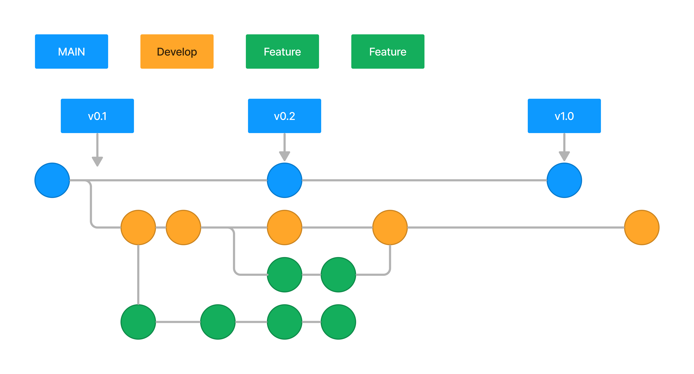
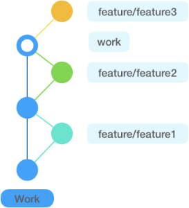

> **형상 관리**
>

이번에 저희 회사에서는,

신규 개발을 앞두고 형상 관리가 이루어지지 않았던 기존 환경에서 **GitHub를 활용한 체계적인 형상 관리 시스템을 도입**하게 되었습니다.

## Git flow 전략

### 1. BRANCH

저희 팀은 Branch를 `MAIN`, `DEV`, `FEATURE` 이렇게 3가지를 가져가기로 했습니다.

- MAIN : 실제 서버에 배포되는 브랜치
- DEV : 테스트 서버에 배포되는 브랜치
- FEATURE : 기능 구현을 위한 브랜치( 로컬 작업 )

### 2. FLOW

전체적인 흐름은 rebase를 통해 Git 히스토리를 단순하고 직관적으로 유지할 수 있도록 하는 것이 목표 입니다.

 

 

- 불필요한 병합 커밋 없이 일관된 선형 히스토리 유지
- 브랜치 병합 전에 충돌을 미리 해결 가능
- `git pull --rebase`를 활용해 최신 코드 반영